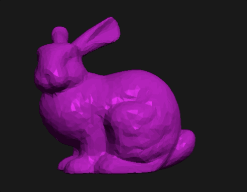
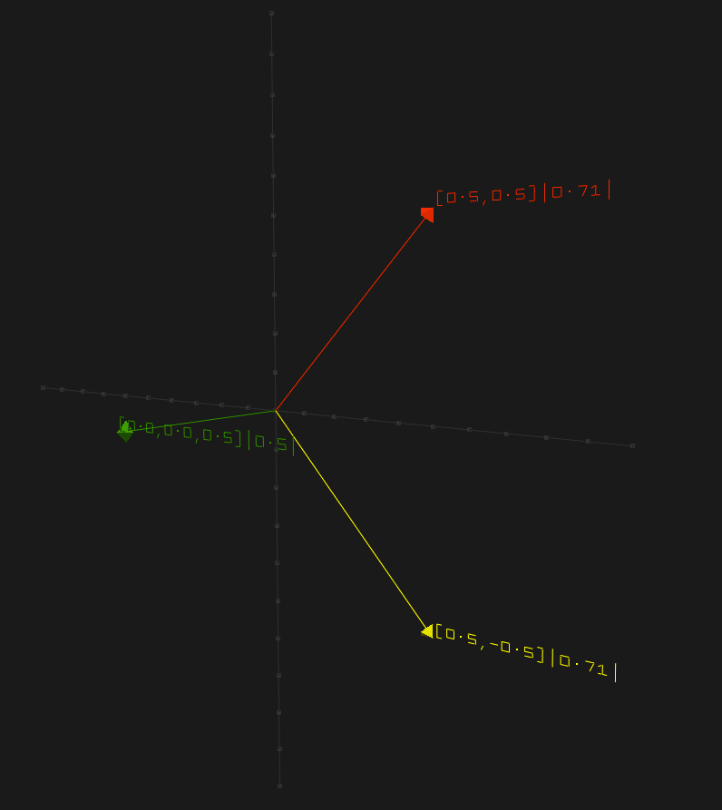

# Slack3D

Simple 3D graphics engine. This library allows rendering geometric shapes with ease.



# Overview

- Phong lighting
- Fly style camera - Freely move around a 3D scene
- Text rendering - English characters and numbers.
- Out of the box Shapes - Vector, Box, Circle, Cone, Cylinder, HeightField, Plane, Point, Pyramid, Sphere, Tetrahedron,
  Triangle, Line & Ray
- OpenGL via LWJGL3
- Immutable API

## Setup

```scala
libraryDependencies += "com.github.simerplaha" %% "slack3d" % "0.1.0"
```

## NOTE

**VM Option**: Allow LWJGL to run on main thread with `-XstartOnFirstThread`. If you are using IntelliJ set the flag in
the "Build and run" window.


## Rendering

Slack3D can be thought of a collection instance where your code provide shapes to render for each frame.

The following will render a red cube.

```scala
Slack3D("My Box") foreach {
  state => //State of current render
    //shapes to render
    Seq(Box(Colour.Red))
}
```


## Rotation

This applies Y axis rotation to the above the box.

```scala
Slack3D("Rotating Box") foreach {
  state =>
    //same code as above but with added rotation at Y axis
    val box = Box(Colour.Red).rotateY(state.getTime() * 30)
    Seq(box)
}
```


Rotation can be applied to all axis. See APIs


## Lines/Vectors

This creates 2 vectors and the third vector is a cross product.

```scala
Slack3D("My rotation Box") foreach {
  state =>
    //Line1
    val line1 =
      Line(
        from = Vector3.origin[Double](),
        to = Vector3(0.5, -0.5),
        colour = Colour.Yellow
      )

    //Line2
    val line2 =
      Line(
        from = Vector3.origin[Double](),
        to = Vector3(0.5, 0.5),
        colour = Colour.Red
      )

    //cross product
    val crossLine =
      Line(
        line1.vector() cross line2.vector(),
        colour = Colour.Green
      )

    Seq(line1, line2, crossLine)
}
```


