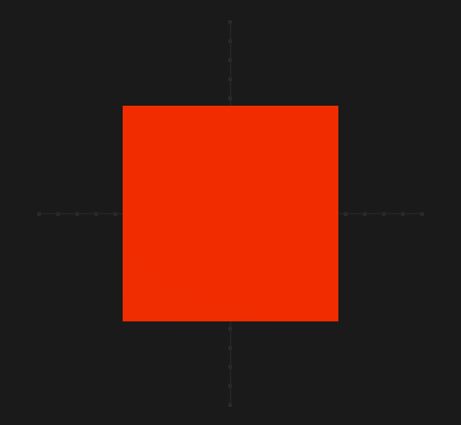

# Slack3D

Simple 3D graphics engine. This library allows rendering geometric shapes with ease.


# Overview

- Phong lighting
- Fly style camera - Freely move around a 3D scene
- Text rendering - English characters and numbers.
- Out of the box Shapes - Vector, Box, Circle, Cone, Cylinder, HeightField, Plane, Point, Pyramid, Sphere, Tetrahedron,
  Triangle, Line & Ray
- OpenGL via LWJGL3
- User input to transform and rotate shapes.
- Basic linear algebra library
- Immutable API

## Key controls

- Hit pause to pause current animation
- Hit enter to return to initial camera view
- W, A, S, D - Move along the 3D axis
- Click mouse to change camera view position

## Setup

```scala
libraryDependencies += "com.github.simerplaha" %% "slack3d" % "0.1.0"
```

## NOTE

**VM Option**: Allow LWJGL to run on main thread with `-XstartOnFirstThread`. If you are using IntelliJ set the flag in
the "Build and run" window.


## Rendering

Slack3D can be thought of a collection instance where your code provide shapes to render for each frame.

Render a red cube.

```scala
Slack3D("My Box") foreach {
  state => //State of current render
    //shapes to render
    Seq(Box(Colour.Red))
}
```



## Rotation

Apply Y axis rotation to the box.

```scala
Slack3D("Rotating Box") foreach {
  state =>
    //same code as above but with added rotation at Y axis
    val box = Box(Colour.Red).rotateY(state.getTime() * 30)
    Seq(box)
}
```


Rotation can be applied to all axis. See APIs


## Lines/Vectors

Create 2 vectors where the third vector is a cross product.

```scala
Slack3D("My rotation Box") foreach {
  state =>
    //vector1
    val vector1 = Vector3(0.5, -0.5, 0)
    //vector2
    val vector2 = Vector3(0.5, 0.5, 0)
    //cross product
    val cross = vector1 cross vector2

    Seq(
      Line(vector1, Colour.Red),
      Line(vector2, Colour.Yellow),
      Line(cross, Colour.Green)
    )
}
```


All `Lines` and `Points` will render a text displaying the position and length of that vector.

## Custom shapes

TODO

## Moving shapes with user input

TODO

## Axis angle rotation

TODO

## `Meshable`

TODO

## Colours

TODO

## Linear algebra

TODO
